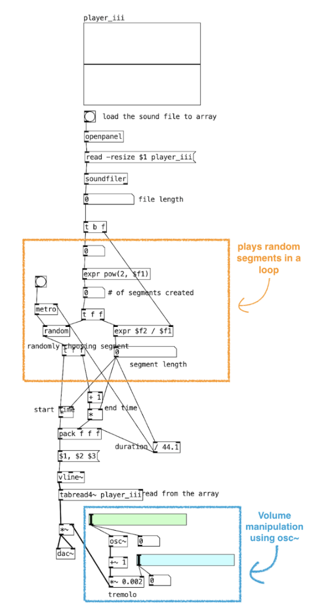
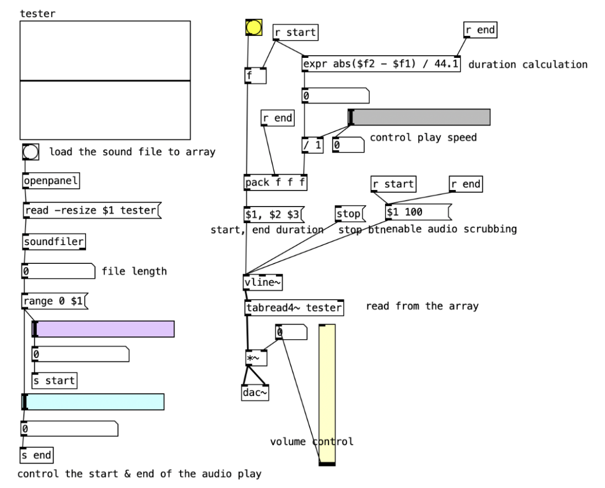
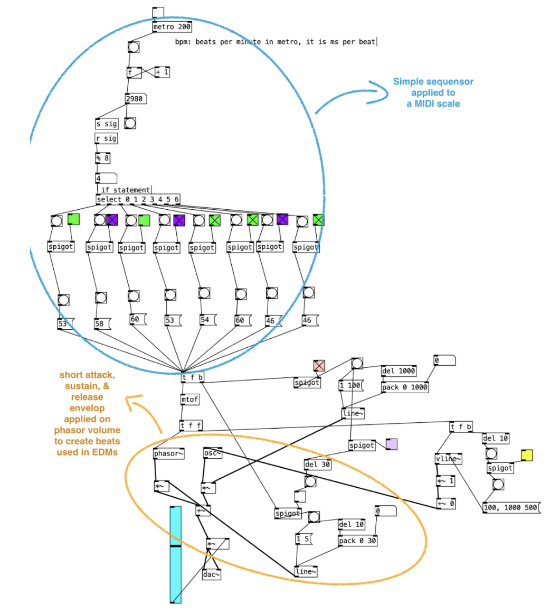
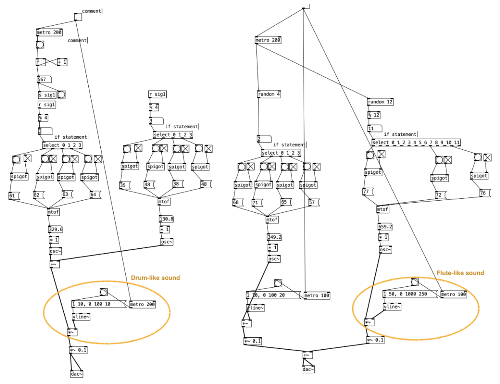
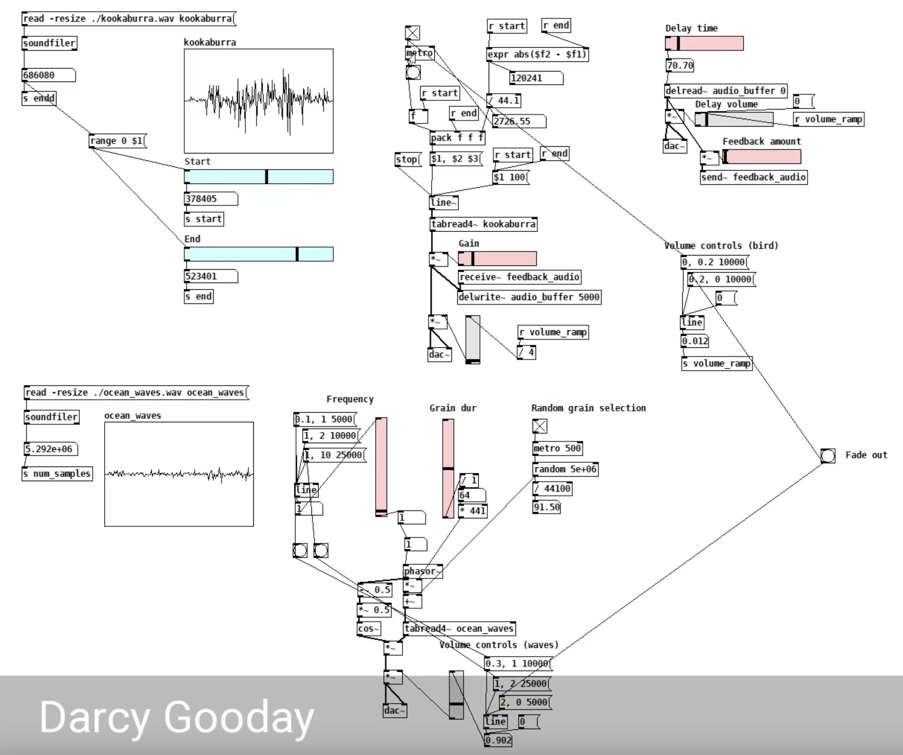
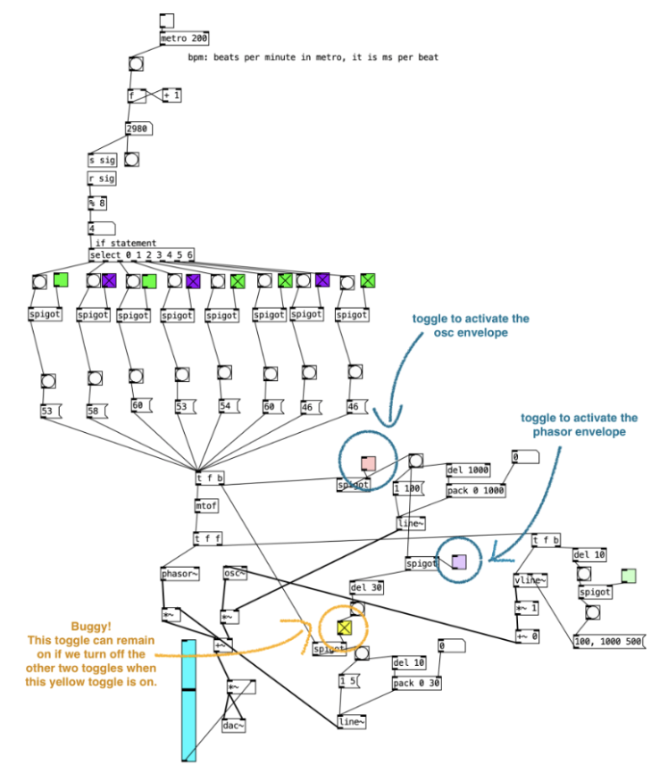
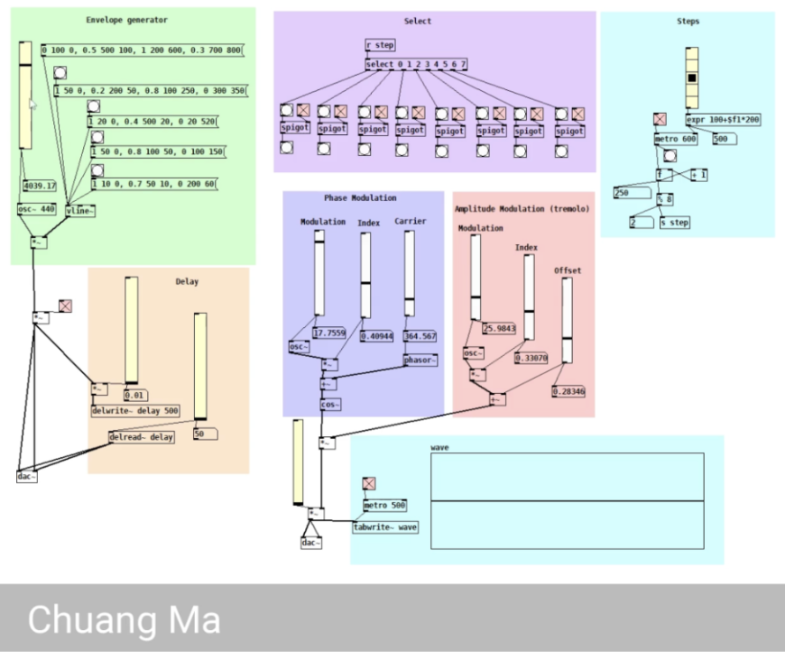
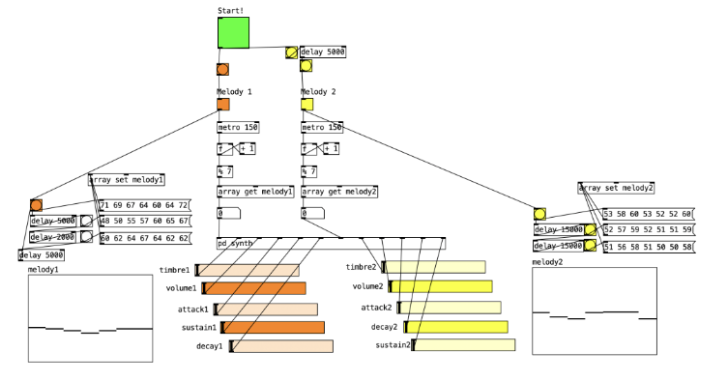

# Portfolio 1 Discussion

Throughout the past four weeks, the main challenge in my diary creation has been being unfamiliar with the pure data features and having little background in music theory. Consequently, trying to find creative expression within my limited music background and pure data experience become a common theme in my dairy pieces. 

My diary creation often begins with an example patch learned from class. Then, the majority of the time is spent experimenting with the sound by modifying different parts of the patches, often using youtube videos for inspiration and for learning the correct pure data construction. Initially, the final product of my diary piece may have been a composition of randomly discovered patches that I liked. But as I gain more understanding from lectures/workshops and my experimentations, my later dairy pieces are able to reflect more control I have over the final product. 

For instance, week 02 was our first introduction to computing music with pure data. Our control over sounds in PD was limited to the two basic inputs of frequency and amplitude to the existing waveform functions such as osc, noise, and phasor. Furthermore, we were also limited by the prompt to use only two sounds. As I searched for inspiration online, I stumbled on the video [Noise and Crackle in Pure Data](https://www.youtube.com/watch?v=hPlCwKbRyEk), which shows how basic waveforms can be passed through filters to generate ambient sounds. So I experimented with different filters on different waveform functions, ultimately finding two simple, but symbolic sounds that mimicked the racing cars and pouring rain outside the window as I was completing my diary. See Figure 1 for my week 02 patch. This dairy is one example where my random experimentation helped me discover a straightforward but good application of the week 2 concepts in basic waveforms and volume control.

Week 03’s diary piece is another product of my random exploration. In class, we learned to load a sound file to an array and perform granular synthesis. The challenge, however, lies in how to add creative expression to convey something about myself. After selecting a simple melody as my sound file, I spent a significant amount of time experimenting with various sound file manipulation techniques. My experimentation led me to discover many new sound manipulation techniques. For example, we can segment our sound array into pieces, then use the metro and random function to play different segments of the sound array in a loop. The volume of the sound can also be controlled by another waveform function to create distortion. 

{ width=50% }

On a side note, compared to week02, this dairy requires a much sophisticated understanding of pure data. It was a nice initial exploration of the more complex manipulations that can be performed on pd for me. My initial unfamiliarity with pd led to a painful process of debugging mistakes in my patches.  

However, carefully commenting on my patches and reading through the pure data document has given me a much more solid understanding of how to program in pd. The active use of comment becomes an important lesson that facilitates a smoother pd programming process in my next few diaries.

{ width=50% }

By week 04 and 05, I was able to feel more at ease in programming melodic pieces. After learning about key concepts such as sequencers, envelopes, and micro, I was able to create more melodic pieces. My experimentation also becomes more self-directed rather than relying on youtube videos for inspiration. Upon playing with envelopes on different waveforms, I was also able to discover many interesting patches that produce different familiar sounds. For example, flute is observed to have a smooth, sustained sound, so I apply a longer decay and release to the osc waveform. In contrast, phasor sounds harsh and buzzy. Applying a short attack, sustain, and decay to the sound can give us the percussive electric backdrop that we often hear in electronic dance music. Having this ability to create a variety of sequensor especially helped me in the week 05 collaborative piece, where I was able to adjust my patches quickly to complement my teammates' patches.

{ width=50% }

{ width=50% }

I also tried to probe ways to create patches that will allow me to have more control during performance. Specifically, I was inspired by my peer Darcy Gooday's week 03 diary, where he couples multiple patches together and uses one toggle to control his piece. 

{ width=50% }

So in my diary, I experimented with linking the phasor envelope with the osc envelope. However, one unintended consequence of my design was that the phasor envelope toggle could remain active even if the read toggle was disabled, leading to a lingering electronic pulse. Rather than viewing this as a bug, I embraced it as a creative feature, using it to create a unique decrescendo effect at the end of my piece. This experience reinforced the important lesson: in algorithmic music, random experimentations can often lead to discoveries of interesting patches that can be harnessed as expressive tools.

{ width=50% }

As my patches grow increasingly complex, I begin to realize the necessity for a clean way of organizing my patches. During the week 4 workshop, I was particularly inspired by Chuang Ma’s diary piece, where he used color boxes to group his patches, creating a clean interface that can be easily manipulated by those who are not familiar with his patches. After the workshop, I tried applying his technique to organize patches, achieving a much more inviting and user-friendly interface.

{ width=50% }

{ width=50% }

## References

Gooday, D. (2025, March). Week 03 Music Diary.  

Ma, C. (2025, March). Week 04 Music Diary.  

QCGInteractiveMusic. (2020, July 13). 10. Noise and Crackle in Pure Data. YouTube.  
[https://www.youtube.com/watch?v=hPlCwKbRyEk](https://www.youtube.com/watch?v=hPlCwKbRyEk)

